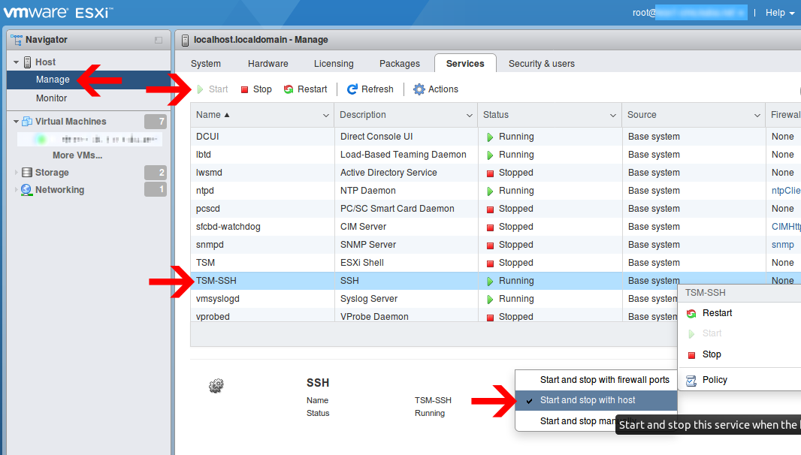

# Cloud Providers

The self service portal currently supports automated provisionings to Azure, AWS and VMware vSphere environments.
For Terraform to work you will have to setup accounts in your preferred Cloud platform.

## Azure

### Service Principal

#### Manual

* [Create a service principal manually](https://www.terraform.io/docs/providers/azurerm/authenticating_via_service_principal.html)

#### Automated

* [Use script file](https://github.com/mheap/terraform-azure-credentials/blob/master/create_credentials)

## AWS

### Access Key / Secret Key

#### Manual

* [Create AWS access key and secret key](https://docs.aws.amazon.com/general/latest/gr/managing-aws-access-keys.html)

#### Automated

* Execute these commands with the AWS CLI:

```bash
aws iam create-group --group-name my-groupname
aws iam create-user --user-name my-username
aws iam add-user-to-group --user-name my-username --group-name my-groupname
aws iam create-access-key --user-name my-username
```

## VMware ESXi

### SSH Service

* Enable SSH access on ESXi Host:



### User Account

* Use your **root** account for the SSH login

### Virtual Machine Templates

* Make sure to create a virtual machine template for Windows Server 2016 and Ubuntu Server 16.04 LTS 
* This can be done manually or with the help of [Packer](https://www.packer.io/)
* It is important to activate DHCP for the network interface
* The default user credentials and template names can be found in this Terraform file [custom.tf](../../modules/cloud-portal-server/src/main/resources/usecase/vm-standalone/esxi/terraform/custom.tf):
  * It is recommended to overwrite these values for production usage

#### Windows Server 2016

* [WinRM](https://msdn.microsoft.com/en-us/library/aa384426(v=vs.85).aspx) is used for executing the Powershell scripts for bootstrapping
* Use this [script](../../public/bootstrap/allow-winrm.cmd) to create a firewall rule and allow execution via HTTP

#### Ubuntu Server 16.04 LTS

* SSH is used for executing bash scripts for bootstrapping
* Make sure to turn on the SSH server
* Use LVM for hard drive partitioning (otherwise live resizing of partitions will not work)

## VMware vSphere

### User Account

* Open vcenter user management
* Create admin account or technical user account for Terraform with these privileges:
  * **Datastore**:
    * Allocate space
    * Browse datastore
    * Low level file operations
    * Remove file
    * Update virtual machine files
    * Update virtual machine metadata
  * **Folder (all)**:
    * Create folder
    * Delete folder
    * Move folder
    * Rename folder
  * **Network**:
    * Assign network
  * **Resource**:
    * Apply recommendation
    * Assign virtual machine to resource pool
  * **Virtual Machine**
    * Configuration (all)
    * Guest Operations (all)
    * Interaction (all)
    * Inventory (all)
    * Provisioning (all)
  * **Manage custom attributes**
    * Set custom attribute

### Custom Attributes

* When provisioning a virtual machine to vSphere Terraform always sets custom attributes
* Make sure that these custom attributes already exist:
  * **Title**
  * **Description**
  * **CreationDate**
  * **OwnedBy**
  * **OwnerGroup**
  * **ProvisioningSystem**

### Virtual Machine Templates

* Make sure to create a virtual machine template for Windows Server 2016 and Ubuntu Server 16.04 LTS 
* This can be done manually or with the help of [Packer](https://www.packer.io/)
* It is important to activate DHCP for the network interface
* The default user credentials and template names can be found in this Terraform file [custom.tf](../../modules/cloud-portal-server/src/main/resources/usecase/vm-standalone/vsphere/terraform/custom.tf):
  * It is recommended to overwrite these values for production usage

#### Windows Server 2016

* [WinRM](https://msdn.microsoft.com/en-us/library/aa384426(v=vs.85).aspx) is used for executing the Powershell scripts for bootstrapping
* Use this [script](../../public/bootstrap/allow-winrm.cmd) to create a firewall rule and allow execution via HTTP

#### Ubuntu Server 16.04 LTS

* SSH is used for executing bash scripts for bootstrapping
* Make sure to turn on the SSH server
* Use LVM for hard drive partitioning (otherwise live resizing of partitions will not work)

### Resource Pools

* It is recommended to create a new resource pool for every team or group using the self service portal in terms of hardware resource isolation